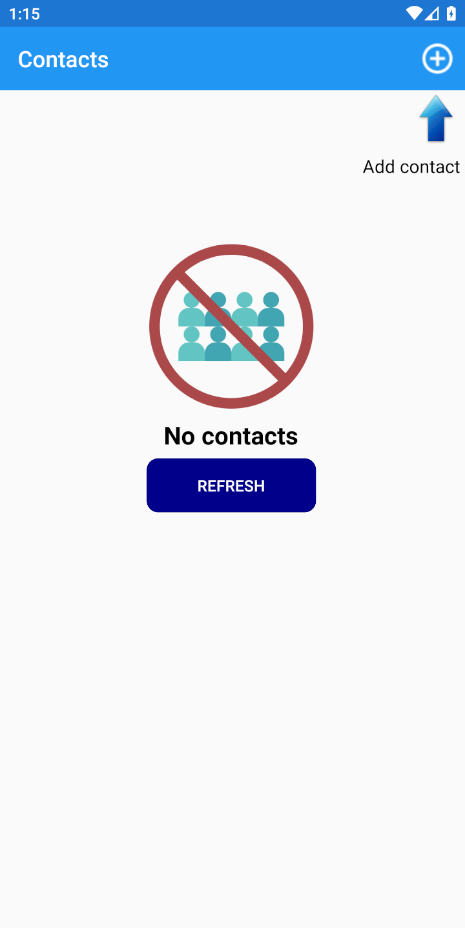
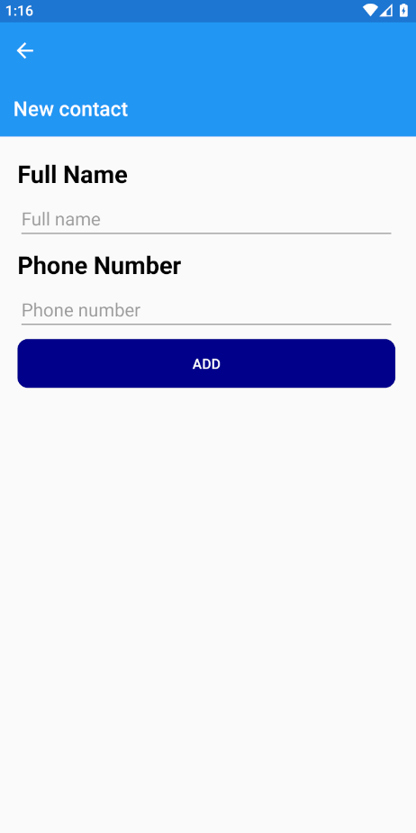
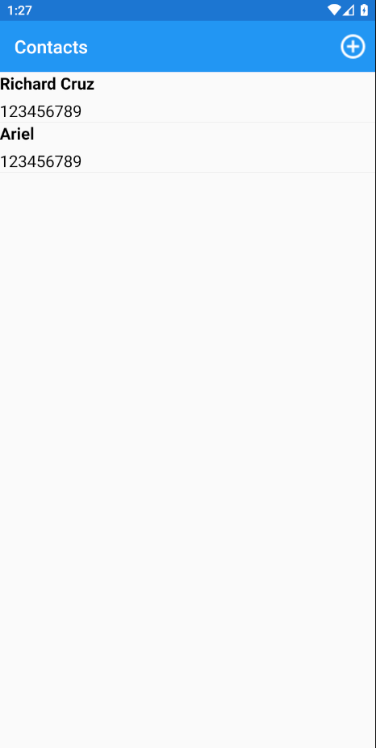
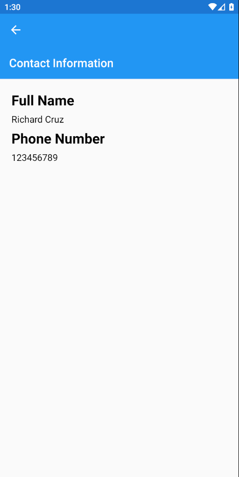
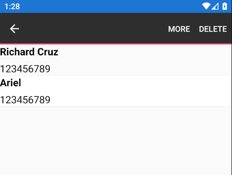
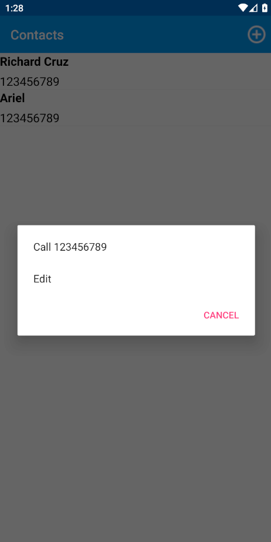
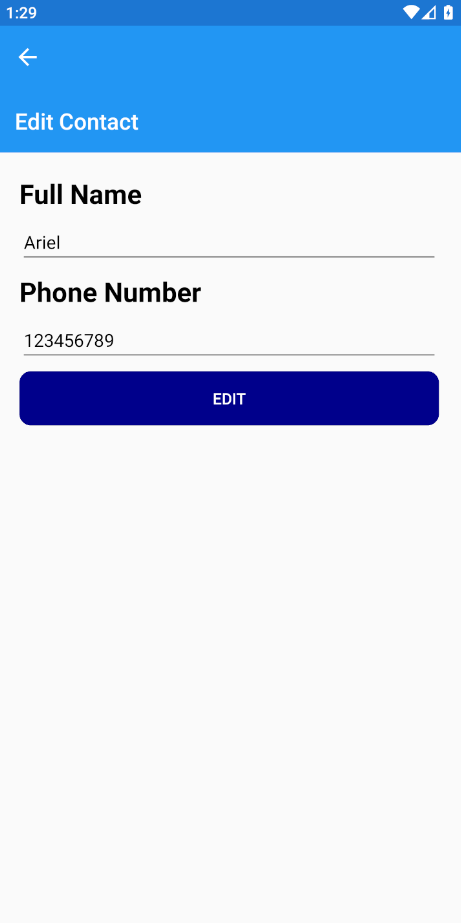

## ContactList
 A list of contacts
 
# Empty page

If there are no contacts, there is an empty page

# New contact

When pressing the + button, it goes to the new contact page

# Contacts

After adding a couple of contacts, it looks like this

# Contact information

If you click one of them, you go the information of that contact

# Context action

Long press on Android and swipe on iOS

# Contect page options

If call is selected, it goes to the phone app

If edit is select it goes to the Edit page

